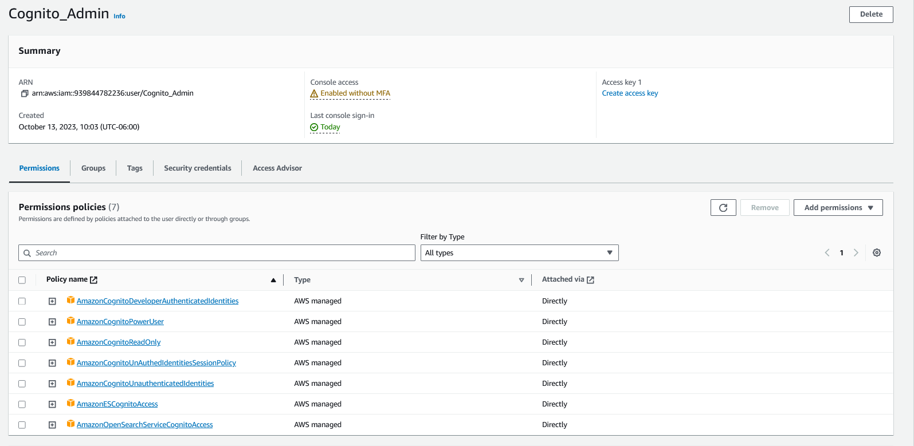
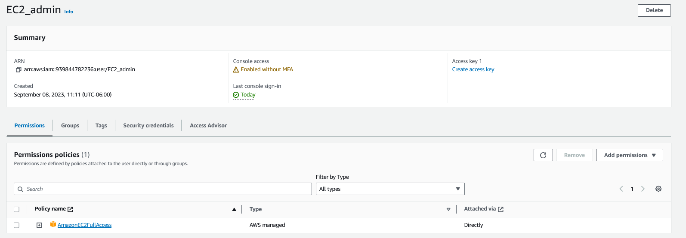

# Semi1-Grupo12-Proyecto2

| Integrantes                   | Carné     |
| :---------------------------- | :-------- |
| Derek Esquivel Díaz           | 202010055 |
| José Andrés Montenegro Santos | 202004804 |
| Carlos Daniel Acabal Pérez    | 202004724 |
| Kevin Nicolas Garcia Martinez | 201403793 |

## ARQUITECTURA IMPLEMENTADA

## USUARIOS IAM

### Cognito

Se creó un usuario con los permisos necesarios para que pueda interactuar con cognito, sin embargo AWS no posee una política de full access para este servicio, por lo cual se le tuvo que asignar un conjunto de políticas para brindarle los privilegios necesarios para usarlo en el desarrollo de la aplicación.

#### Políticas

* **AmazonCognitoDeveloperAuthenticatedIdentitiesInfo**

Este permiso le permite al usuario el acceso a las APIS de Cognito para el soporte de entidades autenticadas por un desarrollador desde un backend de autenticación.

* **AmazonCognitoPowerUser**

Este permiso provee acceso de administración a los recursos ya existentes dentro de Cognito, sin embargo se necesitarán privilegios de administrador de cuentas para crear nuevos recursos.

* **AmazonCognitoReadOnly**

Provee acceso (solamente de lectura) a los recursos de Cognito.

* **AmazonCognitoUnAuthedIdentitiesSessionPolicy**

Esta política es un conjunto de permisos que son permitidos a entidades no autenticadas en las pools de usuarios de Cognito.

* **AmazonCognitoUnauthenticatedIdentities**

Es muy parecida a la anterior, con la diferencia de que la política anterior está más enfocada a evitar que se puedan asignar políticas demasiado permisivas a roles en un grupo de entidades.

* **AmazonESCognitoAccess**

Provee un acceso (limitado) al servicio de configuracion de Cognito.

* **AmazonOpenSearchServiceCognitoAccessInfo**

Provee acceso completo al servicio de configuración de Cognito.

### VPC

A su vez, debido al uso de EC2 y demás servicios que requerirán estar expuestos públicamente, se creó un usuario administrador del servicio VPC, para que este pueda configurar y gestionar el acceso que se tiene a los recursos y servicios de Amazon.

#### Políticas

* **AmazonVPCFullAccess**

Esta política provee un acceso completo a Amazon VPC por medio de la consola de administración de AWS.

### EC2

Como se mencionó anteriormente, algunas de las partes medulares de la arquitectura se encuentran desplegadas en instancias de EC2, por esto entonces se creó un usuario con permisos de administrador sobre este servicio, que fuera capaz de gestionar y editar las configuraciones que se puedan hacer en las instancias.

#### Políticas

* **AmazonVPCFullAccess**
Esta política provee un acceso completo a Amazon EC2 por medio de la consola de administración de AWS.

